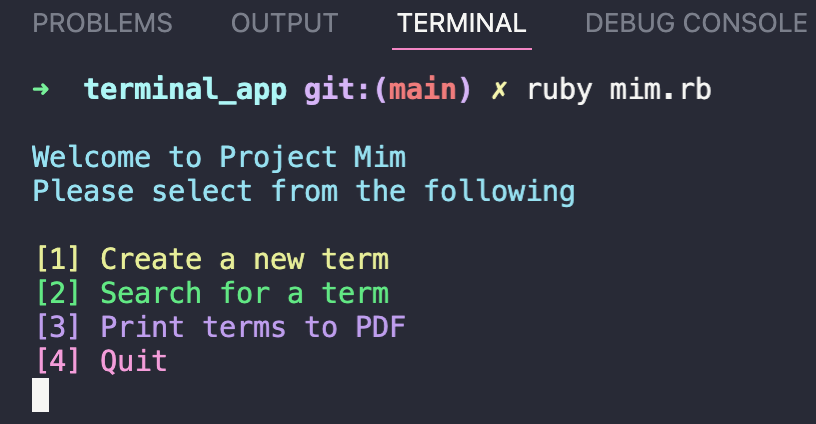
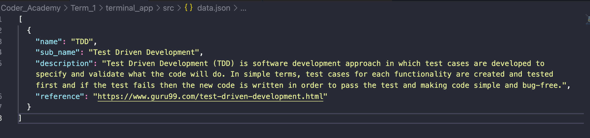
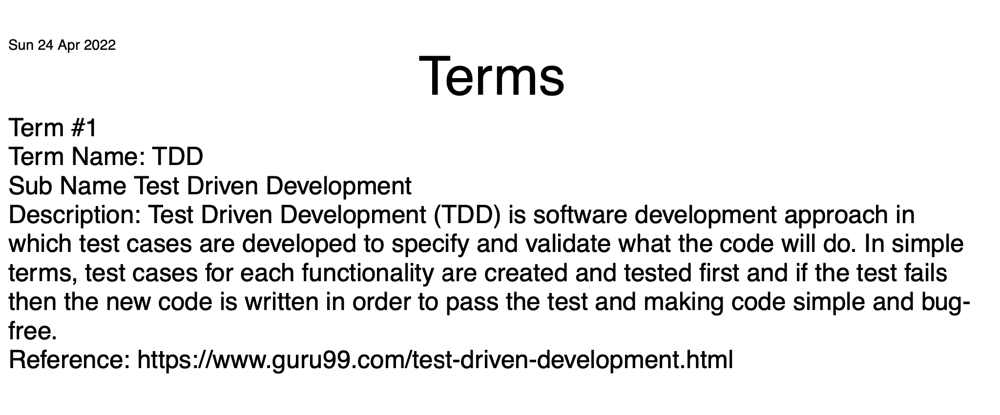
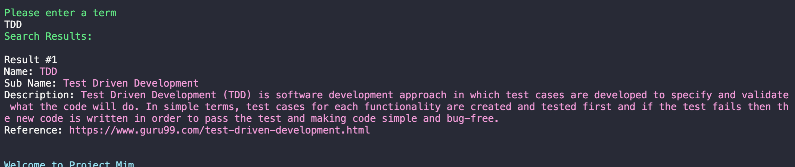
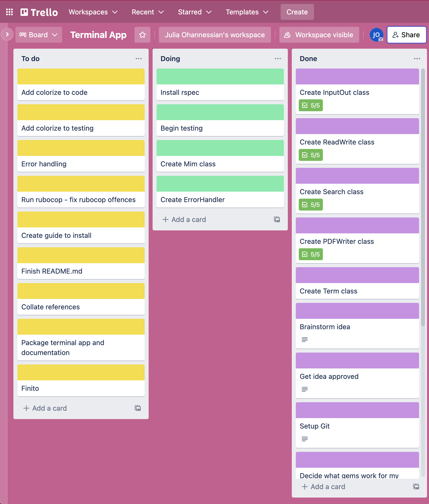
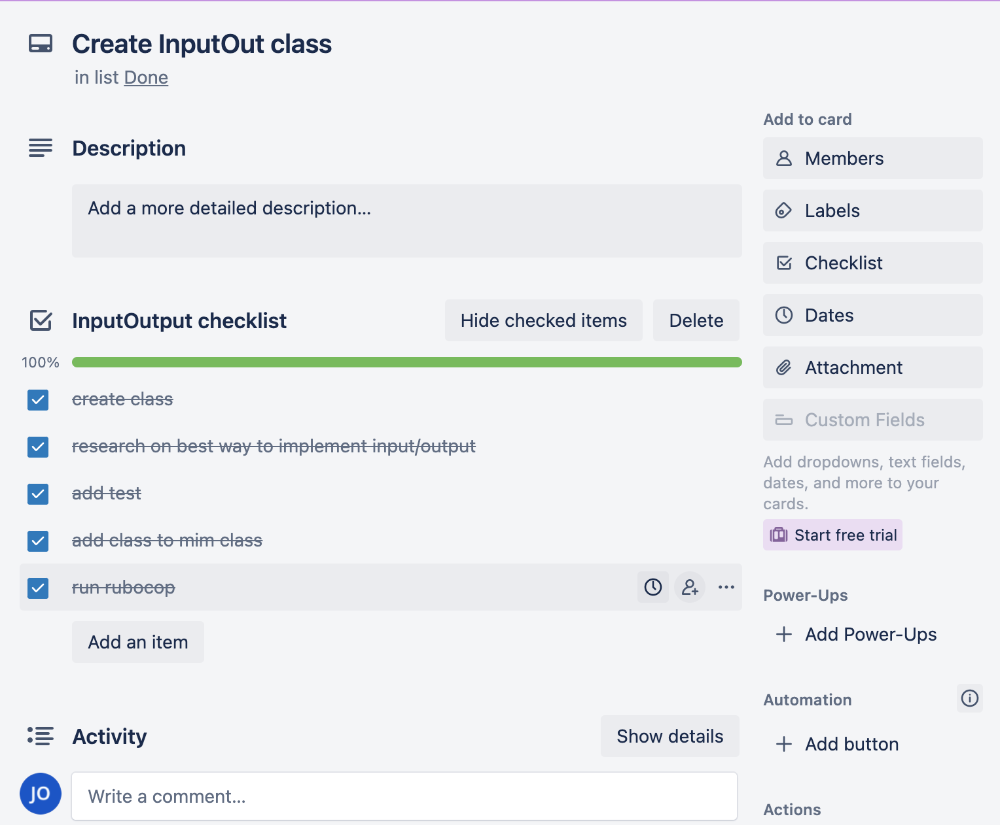
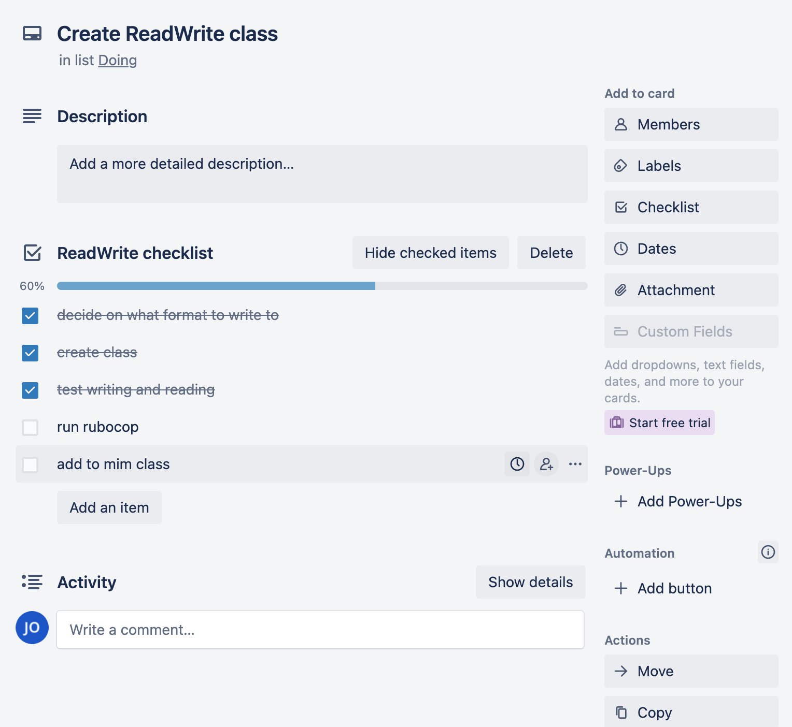

# Project Mim

Project Mim _(a figure in Norse mythology, renowned for his knowledge and wisdom)_

Mim is a terminal app that allows the user to create a glossary of words, terms, phrases and acronyms for themselves. A user can create a new term, look up saved terms and print terms to PDF. The terms that have been created will persist even when the app is closed down and rebooted. The terms can be written to a pdf/text.

I find it difficult to retain information and I felt that this would be a useful app for those that might feel overwhelmed with new terms and things that they are learning. The purpose of Project Mim is to provide users with an application that enables them to document terms which are written to a simple `.json` file. The user can then search for terms that they ahve already stored.

---

## Repository:

https://github.com/Juliaoha/terminal_app

---

## Architecture:

- Classes

  - Search
    - This class is responsible for searching for terms. I have chosen to `amatch` gem library to do pattern matching between the search terms and the store terms. `amatch` returns a score the higher the score the closeer the likeness. This class also sorts the terms by likeness score and returns at most the closest five matches.
  - Term
    - This class creates the term objects.
  - InputOutput
    - This class is responsible for reading user input and outputting to the screen. I found it difficult to test this class but then I found this really helpful [gist](https://gist.github.com/myronmarston/d9a699c1c0c74b992ceb1bbe6b4b2c6c) which I followed
  - ReadWrite
    - Reads and writes to the `json` file.
  - PDFWriter
    - This class writes the stored terms to a PDF file. I have used the `prawn` gem to deal with the writing to PDF and I have included the `date` gem to include the current date on the PDF file.
  - Mim
    - This class runs the application. This is the main class.
  - ErrorHandler
    - This class handles the errors.

- Gems
  - [Prawn](https://github.com/prawnpdf/prawn)
  - [Colorize](https://github.com/fazibear/colorize)
  - [Date](https://github.com/ruby/date/)
  - [Amatch](https://github.com/flori/amatch)
  - [JSON](https://github.com/flori/json/)

---

## Code style guide

I decided to use `RuboCop` as the code style checker and formatter for my terminal app. Before choosing `Rubocop` I did a bit of research to see which code style guide would suit this project best. I found a few alternatives and compared the ratings on GitHub. The ratings for `RuboCop` were by far the best. Please see below for the screenshots of the ratings.


I like that RuboCop is very flexible and can be tweaked via various configuration options. In practice RuboCop supports pretty much every (reasonably popular) coding style that you can think of.

Apart from reporting problems in your code, RuboCop can also automatically fix some of the problems for you. Running `rubocop -A` formatted a lot of the offences.

Rubocop - Style guide

_reference resource: https://rubocop.org/_

---

## Features

### Menu



The menu feature allows the user to make a selection from the above choices. A while loop runs until the user decides to quit the app by entering the value "4". Options "1" to "4" are valid options. If any other values are entered an "Invalid option" message is displayed. The strings have coloured strings through colorize.

### Persisting Data:



The persistence of data is the responsibility of the ReadWrite class. Essentially, we write and read any created terms to a `JSON` file. I thought to do it this way because it felt the most simple and uncomplicated. The terms are written in the above format in the `data.json` file. When the app boots up, the first thing that happens is the terms will be read from this file and stored in an array while the app is running. This allows us to have persistence between the app being shutdown and rebooted.

### Print to PDF:



The ability to print the terms to PDF are controlled by the PDFWrite class. This class uses the `prawn` gem to implement the printing of the PDF. We loop throught the stored terms and print them out in the above format. I;ve also decided to use the `date` change in order to add the current date to the top left hand side of the PDf document

### Search:



The search feature is the responsibility of the Search class. I was thinking of implementing my own search logic but I came across the `amatch` gem. I used the `jaro_similar` method to compare two strings, the search input and the term name. I used [this](https://stackoverflow.com/a/45335093) stack overflow answer as a reference. Basically, this method returns a score based on the likeness. The higher the score the closer the likeness. I then sort the array based on the likeness score and return the top 5 similar terms.

---

## Planning

I used Trello to organise my development process. I found that breaking stuff down into smaller tasks really helped me to get a sense of how much I needed to get done before the due date. I opted to split up my columns into `To do`, `Doing`, and `Done`. This felt like the appropriate format for me to follow. Below is an example of my board:



Above is a snapshot of my baord halfway during my assignment. I broke down all my feature cards into smaller tasks as demonstrated below.

Here is my checklist for input output


And read write



## Installation instructions

I have Ruby version 3.1.1 on my machine. If the version number returned when typing `$ ruby -v` in your terminal is less than that number, install a fresh copy of Ruby just to be safe. Best to use [rbenv](https://github.com/rbenv/rbenv) to manage ruby versions

### Install Ruby

Without `rbenv`

```
$ brew install ruby
```

With `rbenv`

```
$ rbenv install my_version
```

If you come come across any issues here is a link for some help:

[Install Ruby Documentation](https://www.ruby-lang.org/en/documentation/installation/)

## App Installation

This process will download a copy of the project to run on your local machine.

### Clone repository

```
$ git clone git@github.com:Juliaoha/terminal_app.git
```

### Change into directory

```
$ cd src
```

### Run bundle install

```

### Make sure you have bundler installed ###

$ gem install bundler

### Then run the following to install dependencies ###

$ bundle install

```

### Run app

```
$ ./mim.sh
```

### Dependencies

```
gem 'colorize', '~> 0.8.1'

gem 'rubocop', '~> 1.27'

gem 'rspec', '~> 3.11'

gem 'prawn', '~> 2.4'

gem 'date', '~> 3.2'

gem 'json', '~> 2.6'

gem 'amatch', '~> 0.4.0'
```

## Testing

Run this command in the src/ directory to run my tests:

```
$ rspec spec
```
